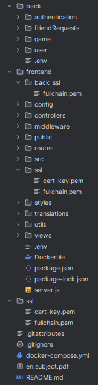

# ft_transcendence
## Description
This project is part of the 42 course curriculum and has been designed to emphasize specific key points based on the [subject](en.subject.pdf). Below, you'll find the necessary setup instructions and configuration details to get the project operational.

## Setup
### SSL/TLS Certificates Setup
Generate your SSL certificates following these streamlined steps. These certificates are crucial for HTTPS communication.
#### Step 1: Generate CA
```bash
openssl genrsa -aes256 -out ca-key.pem 4096
openssl req -new -x509 -sha256 -days 365 -key ca-key.pem -out ca.pem
```
#### Step 2: Generate Certificate
```bash
openssl genrsa -out cert-key.pem 4096
openssl req -new -sha256 -subj "/CN=yourcn" -key cert-key.pem -out cert.csr
echo "subjectAltName=DNS:your-dns.record,IP:257.10.10.1" >> extfile.cnf
openssl x509 -req -sha256 -days 365 -in cert.csr -CA ca.pem -CAkey ca-key.pem -out cert.pem -extfile extfile.cnf -CAcreateserial
```
#### Step 3: Consolidate SSL Files
```bash
cat cert.pem > fullchain.pem
cat ca.pem >> fullchain.pem
```
This consolidates your certificates into a fullchain.pem which will be used along with cert-key.pem in your SSL folder.

### Adding SSL Folder
- [ ] Root Directory
  - Create an SSL folder in the root directory of the project containing cert-key.pem and fullchain.pem
  - For Django, ensure SSL is set up without a hash.
- [ ] Frontend Directory
  - Create an SSL folder similar to the root directory containing cert-key.pem and fullchain.pem with hash included.
  - Additionally, create a back_ssl folder inside the frontend directory. Place the fullchain.pem from the backend into this folder to enable secure communication between the frontend and backend.

### Environment Variables Setup
You need to create two .env files, one for the frontend and one for the backend, with the following configurations and sensitive keys:

- [ ] Frontend
  - Create a .env file in the frontend directory with the following configurations:
    ```bash
    # General Information
    BASE_IP="0.0.0.0"
    BACKEND_AUTH_IP="auth"
    BACKEND_USER_IP="user"
    BACKEND_GAME_IP="game"
    BACKEND_FRIENDS_IP="friends"
    BASE_PORT="3000"
    BACKEND_PORT="4000"
    JWT_SECRET="your_jwt_secret_here"
    SSL_PASS="your_ssl_hash_here"  # Hash of the SSL setup
    EMAIL="your_email_here"
    ```
    - `JWT_SECRET`: Insert your Django secret key here.
    - `SSL_PASS`: Insert the hash of the SSL setup here.
    - `EMAIL`: Insert the email used for two-factor authentication.

- [ ] Backend
  - Create a .env file in the backend directory with the following configurations:
    ```bash
    # OAuth keys and Database configuration
    CLIENT_ID="your_client_id_here"
    CLIENT SECRET="your_client_secret_here"
    REDIRECT_URI="your_redirect_uri_here"
    
    BASE_IP="0.0.0.0"
    
    DJANGO_SUPERUSER_PASSWORD="DjangoPWD"
    DJANGO_SUPERUSER_USERNAME="DjangoAdminUser"
    DJANGO_SECRET_KEY="your_django_secret_key_here"
    
    # Database configuration
    POSTGRES_USER="pguser"
    POSTGRES_PASSWORD="pgpassword"
    POSTGRES_DB="dbname"
    DB_HOST="postgres"
    DB_PORT="5432"
    ```
    - `CLIENT_ID`, `CLIENT_SECRET`, `REDIRECT_URI`: Generate these on the 42 site.
    - `DJANGO_SUPERUSER_PASSWORD`, `DJANGO_SUPERUSER_USERNAME`: Set the Django admin user credentials.
    - `DJANGO_SECRET`: Insert your Django secret key here.
    - `POSTGRES_USER`, `POSTGRES_PASSWORD`, `POSTGRES_DB`, `DB_HOST`, `DB_PORT`: Database credentials are user-defined and should be configured in Django settings.

## Project Components
- `Minor module`: Game Customization Options
- `Minor module`: Use a database for the backend.
- `Minor module`: Use a front-end framework or toolkit.
- `Minor module`: Multiple language supports.
- `Major module`: Standard user management, authentication, users across tournaments. *Note: Match history is not implemented.*
- `Major module`: Designing the Backend as Microservices.
- `Major module`: Implementing a remote authentication.
- `Major module`: Implement Two-Factor Authentication (2FA) and JWT.
- `Major module`: Implementing AI for the game.

## Conclusion
Follow these instructions carefully to set up and run the project as intended. If you encounter any issues, refer back to this guide and check your configurations. For further assistance I attached this screenshot of the project architecture.

